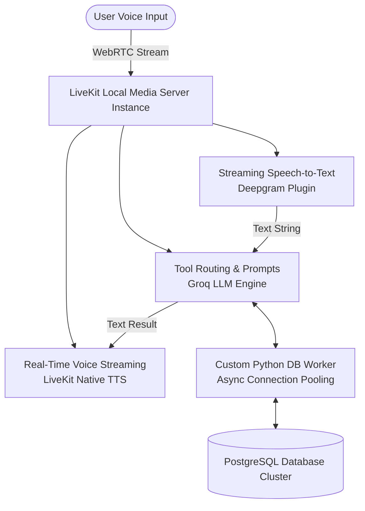

# System Architecture Document

## 1. High-Level Architecture Overview
This project implements a real-time, ultra-low latency Voice AI system using a bi-directional WebRTC streaming engine via LiveKit. The architecture isolates the streaming media plane from the relational data plane, achieving enterprise concurrent processing speeds while using high-throughput open-source LLM layers.

## 2. Core Operational Components
### A. Media Transmission Plane (LiveKit Server)
* **WebRTC Transport Layer:** The native local LiveKit instance sets up full-duplex room connections. Audio tracks generated from the user's microphone are processed chunk-by-chunk over a continuous WebRTC transport stream.
* **Voice Activity Detection (VAD):** Employs Silero VAD filtering to accurately recognize user speech intervals, handling user interruptions cleanly while filtering out ambient background noise.

### B. Cognitive Pipeline (STT ──> LLM ──> TTS)
1. **Streaming STT (Deepgram):** Converts inbound binary WebRTC audio packets directly into raw text streams.
2. **Orchestration Layer (Groq & LLaMA-3-70b):** Groq processes text inputs against our specialized system prompt using an OpenAI-compatible API protocol. It acts as the brain, identifying user intent and executing native tool calls when required.
3. **Streaming TTS (LiveKit Native TTS):** Transforms outbound LLM text strings into natural audio streams, which are immediately broadcast back into the active WebRTC voice loop.

### C. Enterprise Data Plane (PostgreSQL & Async Worker)
* **Connection Pool Management:** Built using asyncpg, a dedicated worker boots up a collection of reusable database handles (min_size=2, max_size=10). This design eliminates the connection handshake penalty during incoming calls.
* **Concurrency Locking (FOR UPDATE):** To protect against simultaneous calls or double-booking conflicts, a row-level transactional read lock isolates selected availability fields until an appointment is successfully written to disk.

## 3. Data Flow Scenario (The Appointment Booking Sequence)
1. **Audio Capture:** The client speaks: "Book an appointment with Dr. Davis at 2:00 PM."
2. **Transcription:** Deepgram processes the speech fragment and outputs a text string.
3. **Function Inference:** Groq intercepts the string, matches it against parameters, and pauses the user verbal track to invoke `book_appointment(patient_name="John", doctor_name="Dr. Davis", slot_time="02:00 PM")`.
4. **Relational Transaction:** The database pool captures an active connection, sets an isolation lock over the respective slot ID, verifies `is_booked = FALSE`, flips the status flag to TRUE, writes the appointment line tracking reference, and closes the transaction block.
5. **Vocal Playback:** The tool passes the raw text answer back to Groq, which speaks the custom confirmation reference string to the user.
